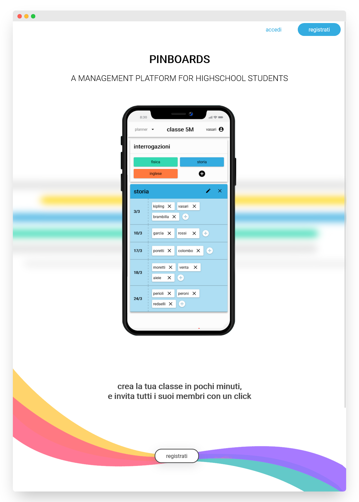

# pinboards
### A management platform for highschool and college students 

available for free on [pinboards.it](https://pinboards.it)

## features:

- full i18n support, currently with Italian and english translations.
- accessible and responsive design, with 100% scores on lighthouse
- prometheus metrics compatibility
- HaveIbeenPwned password apis integration, for increased protection against credential stuffing

## screenshots

## local development

Requirements: php, a mariadb/mysql server. 

These instruction are for a generic wamp / lamp local setup.

- clone this repository into the public folder of your webserver

- in  `pinboards.it\www\core\config\` copy `config.php.example` into a new file `config.php` and configure
  the local database credentials.

### Frontend

requirements: Node.

Navigate into /pinboards.it and run `npm ci` to install the project dependencies. then run `npm start` or `npm run build`

  
- in `pinboards.it/neutrinorc.js` configure the variable ENV_BASE_PATH to contain the application base path of your local webserver.
  This is expecially useful in LAMP/WAMP setups, where the hosted app is not located at http://localhost/index.php and instead is at
  http://localhost/local/base/path/index.php

## deployment

Requirements: Docker

### kubernetes

### database migrations
